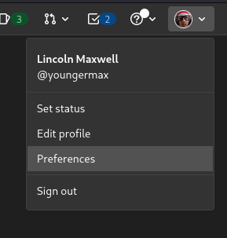
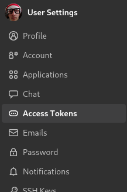
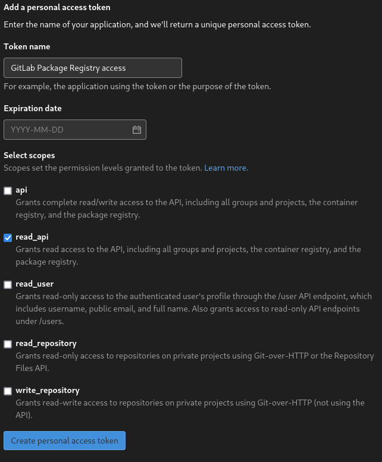
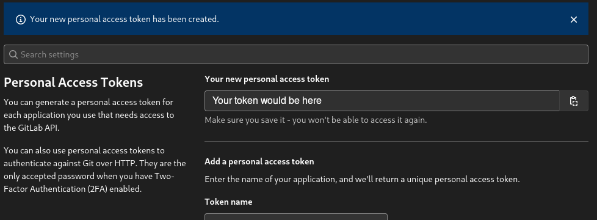

# Pocolifo Client: Welcome

Source tree for PLC!

## Source tree

`other/` Miscellaneous things that may be used in the future.

`obfuscation/` JARs and dictionaries required to obfuscate the client. Will probably be replaced by a Gradle plugin at some point.

`logo/` PLC logos.

`run/` Default working directory for the client.

`src/` Source code

`.gitignore` Git file that ignores files

`.gitlab-ci.yml` Gitlab CI configuration

`README.md` This file

`build.gradle` & `settings.gradle` Gradle build configuration

`gradle.properties.example` Template Gradle properties file that goes in `~/.gradle/`

`gradlew` & `gradlew.bat` Gradle CLI wrapper shell scripts

`upload.sh` CI uses this shell script to upload versions to the API

`gradle/` Gradle wrapper directory

## Getting Started

1. Clone this repository
2. Import project into IntelliJ IDEA.
3. Copy `.gradle.properties.example` to `~/.gradle/gradle.properties` and replace `REPLACE_WITH_YOUR_PERSONAL_ACCESS_TOKEN` with a personal access token obtained from GitLab. The token needs to have `read_api` permissions.
4. Run the `runClient` Gradle task

### How to get an access token

1. Open preferences



2. Navigate to the access tokens section



3. Create a token



4. Copy the token and use it



## IMPORTANT
### For development

Don't use the pipe operator in catch expressions. It messes up obfuscation. In these instances, just catch `Exception`
or `Throwable`.
```java
try {
    // code
} catch (SomeException | AnotherException e) { 
    // code
}
```

### Other
YOU ARE NOT PERMITTED TO PUBLISH THE SOURCE CODE OF POCOLIFO CLIENT UNDER ANY CIRCUMSTANCES, UNLESS PROVIDED WITH EXPLICIT
WRITTEN CONSENT BY LINCOLN MAXWELL!
